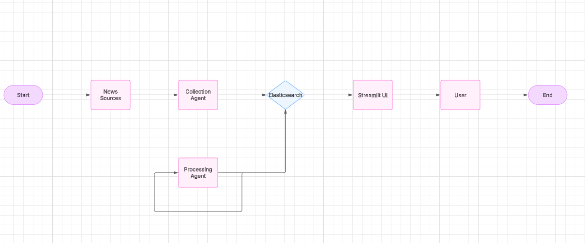
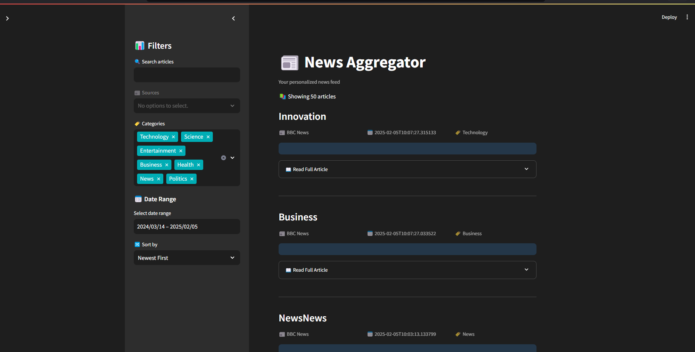

# 📰 Intelligent News Aggregator

A modern news aggregation system that uses AI to collect, process, and present news articles from various sources in a user-friendly interface.


## 🚀 Features

### Automated News Collection
- Real-time news fetching from multiple sources via NewsAPI
- Smart content validation and deduplication
- Structured data storage in Elasticsearch

### AI-Powered Processing
- Automatic article summarization using BART
- Zero-shot category classification
- Content enrichment with metadata

### Advanced Search & Filtering
- Full-text search across articles
- Category and source filtering
- Date range selection
- Multiple sorting options

## 🛠️ Tech Stack

- **Frontend**: Streamlit
- **Backend**: Python with CrewAI
- **Database**: Elasticsearch
- **NLP**: Hugging Face Transformers
- **APIs**: NewsAPI

## 📋 Prerequisites

- Python 3.10+
- Elasticsearch 8.x
- NewsAPI key
- Poetry for dependency management

## 🔧 Installation

1. Clone the repository:
```bash
git clone https://github.com/yourusername/news-aggregator.git
cd news-aggregator
```

2. Install dependencies:
```bash
poetry install
```

3. Configure environment variables:
```bash
# Create .env file
cat > .env << EOL
# Elasticsearch credentials
elastic_username=elastic
elastic_password=your_password

# NewsAPI credentials
news_api_key=your_newsapi_key
EOL
```

4. Start Elasticsearch:
```bash
docker-compose up -d elasticsearch
```

## 🚀 Usage

### Local Development
1. Collect news articles:
```bash
poetry run python data_collection_agent.py
```

2. Process articles:
```bash
poetry run python data_processing_agent.py
```

3. Run the web interface:
```bash
poetry run streamlit run streamlit_app.py
```

### Streamlit Cloud Deployment
1. Fork this repository
2. Sign up for [Streamlit Cloud](https://streamlit.io/cloud)
3. Create a new app and connect it to your forked repository
4. Set the following secrets in Streamlit Cloud:
   - `elastic_username`
   - `elastic_password`
   - `news_api_key`

## 🏗️ Project Structure

```
news-aggregator/
├── data_collection_agent.py  # News collection logic
├── data_processing_agent.py  # AI processing logic
├── streamlit_app.py         # Web interface
├── images/                  # Project images and diagrams
│   ├── system_architecture.png
│   ├── ui_screenshot.png
│   └── demo.gif
├── pyproject.toml          # Dependencies
├── README.md               # Project documentation
├── requirements.txt        # Python dependencies
├── .env.example           # Environment variables template
├── .streamlit/            # Streamlit configuration
│   └── config.toml        # Theme configuration
└── LICENSE                # MIT License
```

## 🌟 Use Cases

1. **Media Monitoring**
   - Track industry news
   - Monitor brand mentions
   - Analyze trends

2. **Research & Analysis**
   - Academic research
   - Market analysis
   - Topic tracking

3. **Content Curation**
   - Personalized news feeds
   - Newsletter generation
   - Content aggregation

## 🤝 Contributing

Contributions are welcome! Please feel free to submit a Pull Request.

## 📝 License

This project is licensed under the MIT License - see the LICENSE file for details.

## 🙏 Acknowledgments

- [Streamlit](https://streamlit.io/)
- [Elasticsearch](https://www.elastic.co/)
- [Hugging Face](https://huggingface.co/)
- [NewsAPI](https://newsapi.org/)

## 📸 Screenshots

### System Architecture


### User Interface


### Demo


